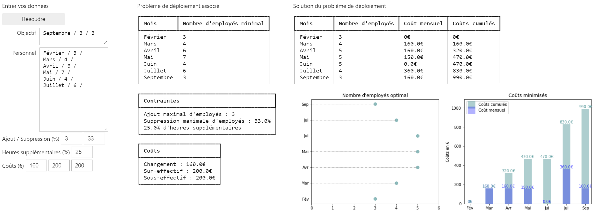

# Déploiement de personnel

## Présentation

L'objectif est de modéliser, résoudre et visualiser de manière interactive un problème de déploiement de personnel en minimisant les coûts associés.

- Création d'un GUI `application.py` permettant de visualiser le problème de déploiement et la solution trouvée.
- Un mode d'emploi nommé `gui_utilisation.md` est disponible avec un tutoriel video.
- Le fichier `modelisation.md` explique le conversion du problème en graphe orienté et revient sur l'utilisation de l'algorithme de Dijkstra.

## Résolution

### `deploiement`

Module contenant les fichiers suivants :

- `probleme.py` pour la conversion du problème en langage python,
- `modelisation.py` pour la conversion du problème en graphe orienté,
- `resolution.py` pour la résolution du problème à l'aide de l'algorithme de Dijkstra.

### `tests`

Module contenant les tests de chaque script `.py` avec utilisation de la librairie `coverage` pour un rapport des tests.

### Aperçu du GUI

