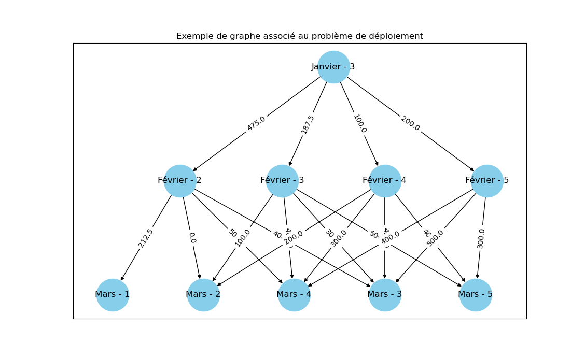

# Modélisation du problème de déploiement

## Notations 

En notant $M$ l'indice du mois d'arrivée, on a $\forall m \in [\![0,\ M]\!]$ :
- $e_m$ le nombre d'employés présents au mois d'indice $m$,
- $e^{min}_m$ le minimum de personnel devant être présent au mois $m$, 
- $e^{max}_m$ le maximum de personnel devant être présent au mois $m$,

avec $\Big(e_m,\ e^{min}_m,\ e^{max}_m\Big) \in \mathbb{N}^3$.

## Objectif 

On souhaite avoir exactement $e_M$ employés au mois d'indice $M$ en minimisant les coûts de l'entreprise.

## Contraintes

### Contraintes syndicales

#### Ajout de personnel

Pour des raisons syndicales on ne peut ajouter plus de $A$ personnes chaque mois, avec $A \in \mathbb{N}$. Cela revient à :

$$e_m - e_{m-1} \leq A \iff e_m \leq A + e_{m-1}$$

#### Suppression de personnel

On ne peut supprimer plus d'$\frac{1}{s}$ du total des présents, avec $s \in \mathbb{R}_+^*$. Ce qui est équivalent à :

$$e_{m-1} - e_m \leq \frac{1}{s}\times e_{m-1} \iff e_m \geq \frac{s-1}{s}\times e_{m-1}$$

### Contraintes sur les heures supplémentaires

Au plus $t$ % d'heures supplémentaires peuvent être effectuées, avec $t \in [\![0,\ 100]\!]$. Ainsi, si $e_0$ employés sont présents le premier mois, cela revient à avoir $\big(1+\frac{t}{100}\big)e_0$ d'employés présents en termes de travail effectué. 

### Contraintes sur les coûts

#### Ajouter ou enlever une personne

On note $C_1$ le coût de changement de personnel. Ajouter ou enlever une personne coûte $C_1$€.

#### Coût de sous-effectif

On note $C_2$ le coût de sous-effectif. Il y a $C_2$ euros de frais par personne manquante par mois, sachant qu'au plus $t$ % d'heures supplémentaires peuvent être effectuées.

$$e_m < e^{min}_m \rightarrow C_2\times \big(e^{min}_m -\Big(1+\frac{t}{100}\big)e_m \Big)€$$

#### Coût de sur-effectif

On note $C_3$ le coût de sur-effectif. Il y a $C_3$ euros de frais liés à la présence de personnel surnuméraire par mois. A noter que cette contrainte ne s'applique que pour le mois cible. 

$$e_m > e^{max}_m \rightarrow C_3€$$

## Conversion du problème en graphe orienté

### Sommets

Chaque sommet du graphe correspond à un état pour un mois donné. Un état se compose du mois d'indice $m$ et du nombre d'employés présents $e_m$.

Exemple : "Février - 3".

### Arrêtes 

Une arrête se compose d'un état de départ "$\text{mois}_{m-1}$ - $e_{m-1}$", d'un état d'arrivée "$\text{mois}_m$ - $e_m$" et du coût associé pour passer de l'état de départ à l'état d'arrivée. 

Exemple : ("Février - 3", "Mars - 4", 160).

#### Un exemple

Un exemple rapide de graphe associé à un problème de déploiement est représenté ici.

## Résolution du problème

### Algorithme de Dijkstra

Minimiser les coûts de l'entreprise pour passer d'un état de départ du type "$\text{mois}_0$ - $e_0$" à un état d'arrivée "$\text{mois}_M$ - $e_M$" revient à trouver le chemin le plus court à parcourir entre ces deux sommets. L'utilisation de l'algorithme de Dijkstra est donc pertinente. La construction du graphe permet de parcourir les mois à la suite des autres, comme indiqué dans l'énoncé.

### Simplification du problème

Etant donné que la seule contrainte portant sur le nombre d'employés maximal ne s'applique que pour le mois d'arrivée, les autres mois doivent seulement respecter les contraintes relatives au nombre d'employés minimal.

Etant donné que l'on peut ajouter $A$ personnes chaque mois, le nombre de sommets du graphe peut très vite devenir trop élevé avec beaucoup de sommets inutiles. Ajouter un employé étant coûteux, il semble non optimal de continuer à ajouter des employés sans poser de limite.   

Pour pallier à ce problème, le choix suivant a été fait. Pour passer du mois d'indice $m-1$ au mois d'indice $m$ on peut ajouter $n$ employés, avec $n \leq A$, si et seulement si le nombre d'employés présent au mois d'indice $m-1$, augmenté de $n$ employés, est inférieur au maximum de l'ensemble des $M$ contraintes sur le nombre d'employés minimal. Autrement dit, on a :

$$e_{m-1} + n \leq \max\{e^{min}_0,\ ...,\ e^{min}_M \}\ ;\ \forall m \in [\![1,\ M+1]\!] $$

**Intuition**

Soit $n$ le nombre d'employés que l'on peut ajouter entre les mois $\text{mois}_{m-1}$ et $\text{mois}_{m}$ avec $n \leq A$. 

On note $E^{min}$ le maximum de l'ensemble des $M$ contraintes sur le nombre d'employés minimal, soit :

$$E^{min} = \max\{e^{min}_0,\ ...,\ e^{min}_M \}$$

Etant donné qu'ajouter un employé coûte $C_1$€, on en déduit que :

$$nC_1 \leq E^{min}C_1 \iff n \leq E^{min}$$

L'objectif étant la minimisation des coûts, il est optimal de continuer à ajouter des employés entre deux mois consécutifs si et seulement si $n \leq E^{min}$. 